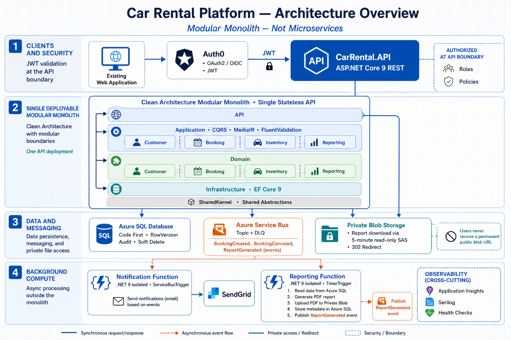

# Car Rental Platform

Production-oriented .NET 9 modular-monolith backend using Clean Architecture.

## Architecture overview



## Projects

- `CarRental.API`: REST host and composition root.
- `CarRental.Application`: CQRS use cases, validation, and ports.
- `CarRental.Domain`: module-owned domain models and rules.
- `CarRental.Infrastructure`: EF Core and external adapter implementations.
- `CarRental.SharedKernel`: minimal domain and application abstractions shared across modules.

Dependencies point inward. Modules (`Customer`, `Booking`, `Inventory`, and `Reporting`) own their business logic inside the Domain and Application layers.

## Local configuration

Do not commit secrets. Override the placeholder Auth0 and Azure SQL values with environment variables, user secrets, or Azure App Configuration/Key Vault:

```text
Auth0__Authority
Auth0__Audience
Auth0__RoleClaimType
ConnectionStrings__CarRentalDatabase
AzureServiceBus__FullyQualifiedNamespace
AzureServiceBus__TopicName
BlobStorage__ServiceUri
```

Azure Service Bus uses `DefaultAzureCredential`. In Azure, assign the API's managed identity the
`Azure Service Bus Data Sender` role on the configured namespace. Local development can authenticate
with the Azure CLI or a supported developer credential; no Service Bus connection string is stored.

Report downloads also use `DefaultAzureCredential`. Assign the API managed identity
`Storage Blob Data Contributor` on the storage account so it can request user-delegation keys and read report blobs. The API
creates HTTPS-only, read-only SAS URLs that expire after five minutes; storage account keys are not used.

## Run

```powershell
dotnet restore
dotnet run --project src/CarRental.API
```

### Angular SPA

The responsive Angular client lives in `src/CarRental.Web` and uses Auth0 Authorization Code Flow with PKCE.
The development configuration matches the API's checked-in Auth0 tenant, audience, and HTTPS launch URL.

In Auth0, add `http://localhost:4200` to the SPA application's **Allowed Callback URLs**, **Allowed Logout
URLs**, and **Allowed Web Origins**. Then run the API and web client in separate terminals:

```powershell
dotnet run --project src/CarRental.API --launch-profile https
cd src/CarRental.Web
npm install
npm start
```

Open `http://localhost:4200`. Auth0 access tokens are attached only to the configured API origin. The custom
`https://car-rental.example.com/roles` claim must include `Administrator` to display and use customer and fleet
management actions. Change `src/environments/environment.ts` for a different API or Auth0 application, and add
the deployed SPA origin to `Cors:AllowedOrigins` through deployment configuration.

Member self-service booking also requires the access token to contain the user's email. Auth0 does not add
profile fields to custom-API access tokens solely because the SPA requests the `email` scope. Add an Auth0
post-login Action that copies `event.user.email`, `event.user.given_name`, and `event.user.family_name` to the
namespaced claims `https://car-rental.example.com/email`, `https://car-rental.example.com/given_name`, and
`https://car-rental.example.com/family_name`. The API links that authenticated `sub` to one customer profile;
members can book only for that profile, while administrators can continue selecting any customer.

Health endpoints are available at `/alive` (process liveness) and `/health` (dependency readiness). Swagger UI is enabled only in Development.

## Core modules

Customer management is exposed at `/api/customers` and requires the `Administrator` role. Vehicle inventory
is exposed at `/api/vehicles`; authenticated users can read inventory while mutations require `Administrator`.
Both modules use soft deletion and SQL row-version concurrency. Send the Base64 row version returned by detail
responses on updates; deletes use the same value in the `If-Match` header.

Apply Code First migrations with:

```powershell
dotnet ef database update --project src/CarRental.Infrastructure --startup-project src/CarRental.API
```

## Tests

- `CarRental.UnitTests` verifies Customer, Vehicle, and Booking aggregate invariants and lifecycle behavior.
- `CarRental.IntegrationTests` hosts the real API pipeline with test authentication, an isolated EF Core store,
  and no-op messaging. It verifies authorization, validation responses, persistence, uniqueness checks, module
  dependencies, and overlapping-booking rejection without requiring Azure credentials.

Run the complete suite with:

```powershell
dotnet test CarRental.slnx --configuration Release
```

## Notification Function

`CarRental.Notification.Function` is a .NET 9 isolated Azure Functions worker. It consumes the
`BookingCreatedIntegrationEvent` from the configured Service Bus topic/subscription and sends booking
confirmation email through SendGrid.

Before deployment:

1. Apply [`deploy/sql/notification-inbox.sql`](deploy/sql/notification-inbox.sql) to the Car Rental database.
2. Create the `notifications` subscription on the `car-rental-events` topic and configure an appropriate
   `MaxDeliveryCount` (for example, 10). Azure Service Bus automatically moves exhausted transient deliveries
   to the subscription's dead-letter queue.
3. Assign the Function managed identity `Azure Service Bus Data Receiver` and the required Azure SQL role.
4. Configure `ServiceBusConnection__fullyQualifiedNamespace`, `NotificationsTopicName`,
   `NotificationsSubscriptionName`, `ConnectionStrings__CarRentalDatabase`, `SendGrid__ApiKey`,
   `SendGrid__FromEmail`, and `SendGrid__FromName` as Function App settings or Key Vault references.

For local development, copy `local.settings.example.json` to `local.settings.json` and supply secrets outside
source control. Malformed messages, missing customer recipients, and permanent SendGrid rejections are explicitly
dead-lettered. Transient failures are thrown for Service Bus redelivery. The SQL inbox prevents repeat sends for
messages already marked completed and coordinates concurrent scaled-out workers.

## Reporting Function

`CarRental.Reporting.Function` is a .NET 9 isolated Timer-trigger worker. By default it runs daily at
02:00 UTC, generates the previous UTC day's rental reports, uploads PDFs to a private Blob container,
stores ownership/blob metadata in Azure SQL, and publishes `ReportGeneratedIntegrationEvent`.

Before deployment:

1. Apply [`deploy/sql/reporting.sql`](deploy/sql/reporting.sql) and add active rows to
   `[reporting].[ReportSubscriptions]`. A nullable `CustomerId` scopes customer reports; a null value is
   intended only for authorized administrative summaries.
2. Assign the Function managed identity `Storage Blob Data Contributor`, `Azure Service Bus Data Sender`,
   and the required Azure SQL permissions.
3. Configure `ReportingSchedule`, `ConnectionStrings__CarRentalDatabase`, `BlobStorage__ServiceUri`,
   `BlobStorage__ContainerName`, `AzureServiceBus__FullyQualifiedNamespace`, and
   `AzureServiceBus__TopicName` as Function App settings or Key Vault references.

The Blob container is created with `PublicAccessType.None`. Events contain the authenticated API path
`/api/reports/{id}/download`; they never expose a Blob URL. Period uniqueness prevents duplicate reports,
and an unpublished metadata record is resumed on the next Timer retry. A visually verified sample is at
[`output/pdf/daily-rental-report-sample.pdf`](output/pdf/daily-rental-report-sample.pdf).
